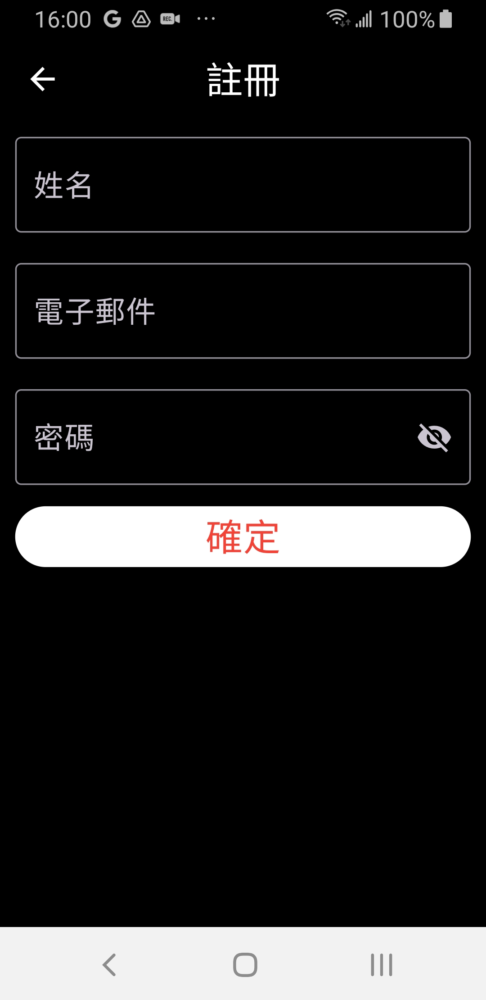
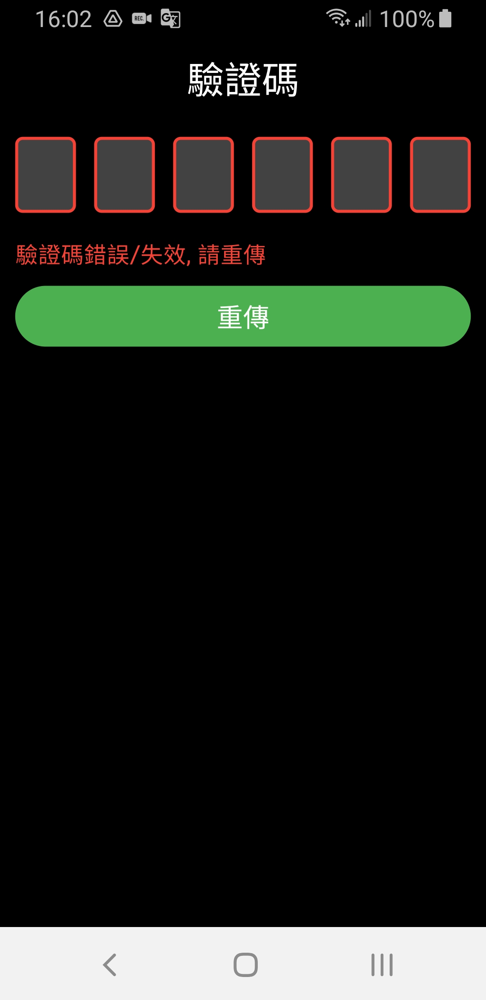

# 🖼️ my_project

🔴 模仿Spotify的功能(練習用) 
✋ 操作 動畫要稍等一下

## 頁面

> **註冊/登入**
<h4><strong>✅ 功能</strong></h4>
<ul>
  <li>註冊</li>
  <li>帳密錯誤提示</li>
  <li>密碼隱藏</li>
  <li>記住密碼</li>
</ul>
<h4><strong>✋ 操作</strong></h4>

| `註冊` | `帳密錯誤提示` | `密碼隱藏` | `記住密碼` |
| :---: | :---: | :---: | :---: |
|  |  |  |  |

 

> **忘記密碼 / 驗證碼**
<h4><strong>✅ 功能</strong></h4>
<ul>
  <li>驗證碼傳送</li>
  <li>驗證碼失效</li>
  <li>驗證碼重傳</li>
  <li>重設密碼</li>
</ul>
<h4><strong>✋ 操作</strong></h4>

| `驗證碼傳送` | `驗證碼失效` | `驗證碼重傳` | `重設密碼` |
| :---: | :---: | :---: | :---: |
|  |  |  |  |

 

> **搜尋**
<h4><strong>✅ 功能</strong></h4>
<ul>
  <li>關鍵字搜尋</li>
</ul>
<h4><strong>✋ 操作</strong></h4>

| `關鍵字搜尋` |
| :---: |
|  |

