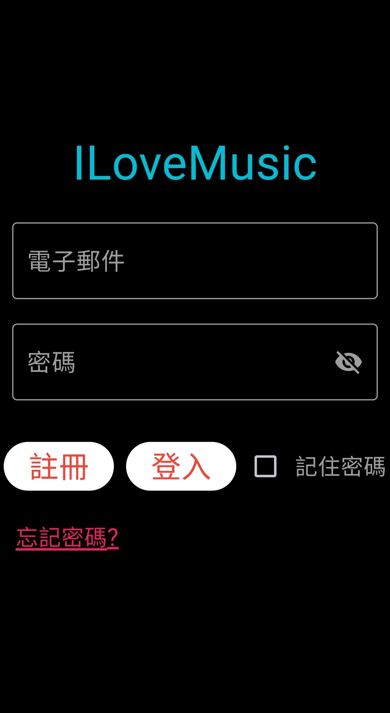

# 🖼️ my_project

模仿Spotify的功能(練習用)

<h2>頁面</h2>
> 註冊/登入
<table>
<tr>
<td>
  
</td>
<td valign="top">
  <h4>功能</h4>
  <ul>
    <li>忘記密碼</li>
    <li>搜尋</li>
    <li>交流</li>
    <li>音樂庫</li>
    <li>我的</li>
  </ul>
</td>
</tr>
</table>

