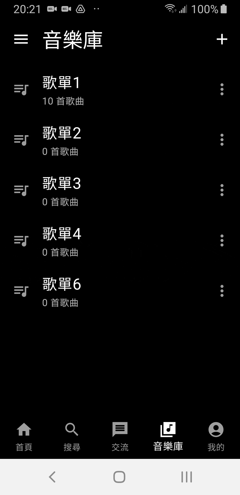
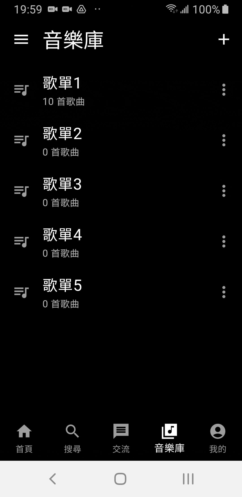

# 🖼️ my_project

🔴 模仿Spotify的功能(練習用) 
🔴 尚未實作所有功能 
✋ 操作 動畫要稍等一下

## 頁面

> **註冊/登入**
<h4><strong>✅ 功能</strong></h4>
<ul>
  <li>註冊</li>
  <li>帳密錯誤提示</li>
  <li>密碼隱藏</li>
  <li>記住密碼</li>
</ul>
<h4><strong>✋ 操作</strong></h4>

| `註冊` | `帳密錯誤提示` | `密碼隱藏` | `記住密碼` |
| :---: | :---: | :---: | :---: |
|  |  |  |  |

 

> **忘記密碼 / 驗證碼**
<h4><strong>✅ 功能</strong></h4>
<ul>
  <li>驗證碼傳送</li>
  <li>驗證碼失效</li>
  <li>驗證碼重傳</li>
  <li>重設密碼</li>
</ul>
<h4><strong>✋ 操作</strong></h4>

| `驗證碼傳送` | `驗證碼失效` | `驗證碼重傳` | `重設密碼` |
| :---: | :---: | :---: | :---: |
|  |  |  |  |

 

> **搜尋**
<h4><strong>✅ 功能</strong></h4>
<ul>
  <li>關鍵字搜尋</li>
</ul>
<h4><strong>✋ 操作</strong></h4>

| `關鍵字搜尋` |
| :---: |
|  |

 

> **小播放器**
<h4><strong>✅ 功能</strong></h4>
<ul>
  <li>暫停、播放、可調式進度條</li>
  <li>每首歌匹配不同背景色</li>
</ul>
<h4><strong>✋ 操作</strong></h4>

| `暫停、播放、可調式進度條` | `每首歌匹配不同背景色` |
| :---: | :---: |
|  |  |

 

> **大播放器(一)**
<h4><strong>✅ 功能</strong></h4>
<ul>
  <li>可縮回小播放器</li>
  <li>與小播放器同步</li>
  <li>可調式進度條</li>
</ul>
<h4><strong>✋ 操作</strong></h4>

| `可縮回小播放器` | `與小播放器同步` | `可調式進度條` |
| :---: | :---: | :---: |
|  |  |  |

> **大播放器(二)**
<h4><strong>✅ 功能</strong></h4>
<ul>
  <li>短按⏮️/⏭️切歌</li>
  <li>長按⏮️每次快退10s/⏭️每次快進10s</li>
</ul>
<h4><strong>✋ 操作</strong></h4>

| `短按⏮️/⏭️切歌` | `長按⏮️每次快退10s/⏭️每次快進10s` |
| :---: | :---: |
|  |  |

> **大播放器(三)**
<h4><strong>✅ 功能</strong></h4>
<ul>
  <li>隨機撥放</li>
  <li>歌單循環</li>
  <li>單曲循環</li>
</ul>
<h4><strong>✋ 操作</strong></h4>

| `隨機撥放` | `歌單循環` | `單曲循環` |
| :---: | :---: | :---: |
|  |  |  |

> **大播放器(四)**
<h4><strong>✅ 功能</strong></h4>
<ul>
  <li>從指定歌單加入歌曲</li>
  <li>從指定歌單移除歌曲</li>
  <li>查看當前播放順序佇列</li>
</ul>
<h4><strong>✋ 操作</strong></h4>

| `從指定歌單加入歌曲` | `從指定歌單移除歌曲` | `查看當前播放順序佇列` |
| :---: | :---: | :---: |
|  |  |  |

 

> **歌單**
<h4><strong>✅ 功能</strong></h4>
<ul>
  <li>創建歌單</li>
  <li>刪除歌單</li>
  <li>重新命名歌單</li>
  <li>刪除歌單中歌曲</li>
</ul>
<h4><strong>✋ 操作</strong></h4>

| `創建歌單` | `刪除歌單` | `重新命名歌單` | `刪除歌單中歌曲` |
| :---: | :---: | :---: | :---: |
|  |  |  |  |

